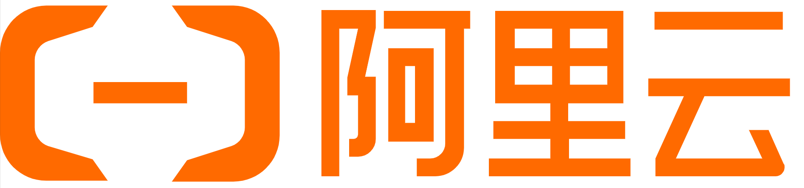

<p align="right">
   <a href="./README.md">中文</a> | <a href="./README.en.md">English</a> | <strong>Français</strong> | <a href="./README.ja.md">日本語</a>
</p>

> [!NOTE]
> **MT (Traduction Automatique)**: Ce document est traduit automatiquement. Pour les informations les plus précises, veuillez vous référer à la [version chinoise](./README.md).

<div align="center">


# New API

🍥 Passerelle de modèles étendus de nouvelle génération et système de gestion d'actifs d'IA

<a href="https://trendshift.io/repositories/8227" target="_blank"></a>

<p align="center">
  <a href="https://raw.githubusercontent.com/Calcium-Ion/new-api/main/LICENSE">
    
  </a>
  <a href="https://github.com/Calcium-Ion/new-api/releases/latest">
    
  </a>
  <a href="https://github.com/users/Calcium-Ion/packages/container/package/new-api">
    
  </a>
  <a href="https://hub.docker.com/r/CalciumIon/new-api">
    
  </a>
  <a href="https://goreportcard.com/report/github.com/Calcium-Ion/new-api">
    
  </a>
</p>
</div>

## 📝 Description du projet

> [!NOTE]
> Il s'agit d'un projet open-source développé sur la base de [One API](https://github.com/songquanpeng/one-api)

> [!IMPORTANT]
> - Ce projet est uniquement destiné à des fins d'apprentissage personnel, sans garantie de stabilité ni de support technique.
> - Les utilisateurs doivent se conformer aux [Conditions d'utilisation](https://openai.com/policies/terms-of-use) d'OpenAI et aux **lois et réglementations applicables**, et ne doivent pas l'utiliser à des fins illégales.
> - Conformément aux [《Mesures provisoires pour la gestion des services d'intelligence artificielle générative》](http://www.cac.gov.cn/2023-07/13/c_1690898327029107.htm), veuillez ne fournir aucun service d'IA générative non enregistré au public en Chine.

<h2>🤝 Partenaires de confiance</h2>
<p id="premium-sponsors">&nbsp;</p>
<p align="center"><strong>Sans ordre particulier</strong></p>
<p align="center">
  <a href="https://www.cherry-ai.com/" target=_blank></a>
  <a href="https://bda.pku.edu.cn/" target=_blank></a>
  <a href="https://www.compshare.cn/?ytag=GPU_yy_gh_newapi" target=_blank></a>
  <a href="https://www.aliyun.com/" target=_blank></a>
  <a href="https://io.net/" target=_blank></a>
</p>
<p>&nbsp;</p>

## 📚 Documentation

Pour une documentation détaillée, veuillez consulter notre Wiki officiel : [https://docs.newapi.pro/](https://docs.newapi.pro/)

Vous pouvez également accéder au DeepWiki généré par l'IA :
[](https://deepwiki.com/QuantumNous/new-api)

## ✨ Fonctionnalités clés

New API offre un large éventail de fonctionnalités, veuillez vous référer à [Présentation des fonctionnalités](https://docs.newapi.pro/wiki/features-introduction) pour plus de détails :

1. 🎨 Nouvelle interface utilisateur
2. 🌍 Prise en charge multilingue
3. 💰 Fonctionnalité de recharge en ligne, prend actuellement en charge EPay et Stripe
4. 🔍 Prise en charge de la recherche de quotas d'utilisation avec des clés (fonctionne avec [neko-api-key-tool](https://github.com/Calcium-Ion/neko-api-key-tool))
5. 🔄 Compatible avec la base de données originale de One API
6. 💵 Prise en charge de la tarification des modèles de paiement à l'utilisation
7. ⚖️ Prise en charge de la sélection aléatoire pondérée des canaux
8. 📈 Tableau de bord des données (console)
9. 🔒 Regroupement de jetons et restrictions de modèles
10. 🤖 Prise en charge de plus de méthodes de connexion par autorisation (LinuxDO, Telegram, OIDC)
11. 🔄 Prise en charge des modèles Rerank (Cohere et Jina), [Documentation de l'API](https://docs.newapi.pro/api/jinaai-rerank)
12. ⚡ Prise en charge de l'API OpenAI Realtime (y compris les canaux Azure), [Documentation de l'API](https://docs.newapi.pro/api/openai-realtime)
13. ⚡ Prise en charge du format Claude Messages, [Documentation de l'API](https://docs.newapi.pro/api/anthropic-chat)
14. Prise en charge de l'accès à l'interface de discussion via la route /chat2link
15. 🧠 Prise en charge de la définition de l'effort de raisonnement via les suffixes de nom de modèle :
    1. Modèles de la série o d'OpenAI
        - Ajouter le suffixe `-high` pour un effort de raisonnement élevé (par exemple : `o3-mini-high`)
        - Ajouter le suffixe `-medium` pour un effort de raisonnement moyen (par exemple : `o3-mini-medium`)
        - Ajouter le suffixe `-low` pour un effort de raisonnement faible (par exemple : `o3-mini-low`)
    2. Modèles de pensée de Claude
        - Ajouter le suffixe `-thinking` pour activer le mode de pensée (par exemple : `claude-3-7-sonnet-20250219-thinking`)
16. 🔄 Fonctionnalité de la pensée au contenu
17. 🔄 Limitation du débit du modèle pour les utilisateurs
18. 🔄 Fonctionnalité de conversion de format de requête, prenant en charge les trois conversions de format suivantes :
    1. OpenAI Chat Completions => Claude Messages
    2. Claude Messages => OpenAI Chat Completions (peut être utilisé pour Claude Code pour appeler des modèles tiers)
    3. OpenAI Chat Completions => Gemini Chat
19. 💰 Prise en charge de la facturation du cache, qui permet de facturer à un ratio défini lorsque le cache est atteint :
    1. Définir l'option `Ratio de cache d'invite` dans `Paramètres système->Paramètres de fonctionnement`
    2. Définir le `Ratio de cache d'invite` dans le canal, plage de 0 à 1, par exemple, le définir sur 0,5 signifie facturer à 50 % lorsque le cache est atteint
    3. Canaux pris en charge :
        - [x] OpenAI
        - [x] Azure
        - [x] DeepSeek
        - [x] Claude

## Prise en charge des modèles

Cette version prend en charge plusieurs modèles, veuillez vous référer à [Documentation de l'API-Interface de relais](https://docs.newapi.pro/api) pour plus de détails :

1. Modèles tiers **gpts** (gpt-4-gizmo-*)
2. Canal tiers [Midjourney-Proxy(Plus)](https://github.com/novicezk/midjourney-proxy), [Documentation de l'API](https://docs.newapi.pro/api/midjourney-proxy-image)
3. Canal tiers [Suno API](https://github.com/Suno-API/Suno-API), [Documentation de l'API](https://docs.newapi.pro/api/suno-music)
4. Canaux personnalisés, prenant en charge la saisie complète de l'adresse d'appel
5. Modèles Rerank ([Cohere](https://cohere.ai/) et [Jina](https://jina.ai/)), [Documentation de l'API](https://docs.newapi.pro/api/jinaai-rerank)
6. Format de messages Claude, [Documentation de l'API](https://docs.newapi.pro/api/anthropic-chat)
7. Format Google Gemini, [Documentation de l'API](https://docs.newapi.pro/api/google-gemini-chat/)
8. Dify, ne prend actuellement en charge que chatflow
9. Pour plus d'interfaces, veuillez vous référer à la [Documentation de l'API](https://docs.newapi.pro/api)

## Configuration des variables d'environnement

Pour des instructions de configuration détaillées, veuillez vous référer à [Guide d'installation-Configuration des variables d'environnement](https://docs.newapi.pro/installation/environment-variables) :

- `GENERATE_DEFAULT_TOKEN` : S'il faut générer des jetons initiaux pour les utilisateurs nouvellement enregistrés, la valeur par défaut est `false`
- `STREAMING_TIMEOUT` : Délai d'expiration de la réponse en streaming, la valeur par défaut est de 300 secondes
- `DIFY_DEBUG` : S'il faut afficher les informations sur le flux de travail et les nœuds pour les canaux Dify, la valeur par défaut est `true`
- `FORCE_STREAM_OPTION` : S'il faut remplacer le paramètre client stream_options, la valeur par défaut est `true`
- `GET_MEDIA_TOKEN` : S'il faut compter les jetons d'image, la valeur par défaut est `true`
- `GET_MEDIA_TOKEN_NOT_STREAM` : S'il faut compter les jetons d'image dans les cas sans streaming, la valeur par défaut est `true`
- `UPDATE_TASK` : S'il faut mettre à jour les tâches asynchrones (Midjourney, Suno), la valeur par défaut est `true`
- `COHERE_SAFETY_SETTING` : Paramètres de sécurité du modèle Cohere, les options sont `NONE`, `CONTEXTUAL`, `STRICT`, la valeur par défaut est `NONE`
- `GEMINI_VISION_MAX_IMAGE_NUM` : Nombre maximum d'images pour les modèles Gemini, la valeur par défaut est `16`
- `MAX_FILE_DOWNLOAD_MB` : Taille maximale de téléchargement de fichier en Mo, la valeur par défaut est `20`
- `CRYPTO_SECRET` : Clé de chiffrement utilisée pour chiffrer le contenu de la base de données
- `AZURE_DEFAULT_API_VERSION` : Version de l'API par défaut du canal Azure, la valeur par défaut est `2025-04-01-preview`
- `NOTIFICATION_LIMIT_DURATION_MINUTE` : Durée de la limite de notification, la valeur par défaut est de `10` minutes
- `NOTIFY_LIMIT_COUNT` : Nombre maximal de notifications utilisateur dans la durée spécifiée, la valeur par défaut est `2`
- `ERROR_LOG_ENABLED=true` : S'il faut enregistrer et afficher les journaux d'erreurs, la valeur par défaut est `false`

## Déploiement

Pour des guides de déploiement détaillés, veuillez vous référer à [Guide d'installation-Méthodes de déploiement](https://docs.newapi.pro/installation) :

> [!TIP]
> Dernière image Docker : `calciumion/new-api:latest`

### Considérations sur le déploiement multi-machines
- La variable d'environnement `SESSION_SECRET` doit être définie, sinon l'état de connexion sera incohérent sur plusieurs machines
- Si vous partagez Redis, `CRYPTO_SECRET` doit être défini, sinon le contenu de Redis ne pourra pas être consulté sur plusieurs machines

### Exigences de déploiement
- Base de données locale (par défaut) : SQLite (le déploiement Docker doit monter le répertoire `/data`)
- Base de données distante : MySQL version >= 5.7.8, PgSQL version >= 9.6

### Méthodes de déploiement

#### Utilisation de la fonctionnalité Docker du panneau BaoTa
Installez le panneau BaoTa (version **9.2.0** ou supérieure), recherchez **New-API** dans le magasin d'applications et installez-le.
[Tutoriel avec des images](./docs/BT.md)

#### Utilisation de Docker Compose (recommandé)
```shell
# Télécharger le projet
git clone https://github.com/Calcium-Ion/new-api.git
cd new-api
# Modifier docker-compose.yml si nécessaire
# Démarrer
docker-compose up -d
```

#### Utilisation directe de l'image Docker
```shell
# Utilisation de SQLite
docker run --name new-api -d --restart always -p 3000:3000 -e TZ=Asia/Shanghai -v /home/ubuntu/data/new-api:/data calciumion/new-api:latest

# Utilisation de MySQL
docker run --name new-api -d --restart always -p 3000:3000 -e SQL_DSN="root:123456@tcp(localhost:3306)/oneapi" -e TZ=Asia/Shanghai -v /home/ubuntu/data/new-api:/data calciumion/new-api:latest
```

## Nouvelle tentative de canal et cache
La fonctionnalité de nouvelle tentative de canal a été implémentée, vous pouvez définir le nombre de tentatives dans `Paramètres->Paramètres de fonctionnement->Paramètres généraux`. Il est **recommandé d'activer la mise en cache**.

### Méthode de configuration du cache
1. `REDIS_CONN_STRING` : Définir Redis comme cache
2. `MEMORY_CACHE_ENABLED` : Activer le cache mémoire (pas besoin de le définir manuellement si Redis est défini)

## Documentation de l'API

Pour une documentation détaillée de l'API, veuillez vous référer à [Documentation de l'API](https://docs.newapi.pro/api) :

- [API de discussion](https://docs.newapi.pro/api/openai-chat)
- [API d'image](https://docs.newapi.pro/api/openai-image)
- [API de rerank](https://docs.newapi.pro/api/jinaai-rerank)
- [API en temps réel](https://docs.newapi.pro/api/openai-realtime)
- [API de discussion Claude](https://docs.newapi.pro/api/anthropic-chat)
- [API de discussion Google Gemini](https://docs.newapi.pro/api/google-gemini-chat)

## Projets connexes
- [One API](https://github.com/songquanpeng/one-api) : Projet original
- [Midjourney-Proxy](https://github.com/novicezk/midjourney-proxy) : Prise en charge de l'interface Midjourney
- [neko-api-key-tool](https://github.com/Calcium-Ion/neko-api-key-tool) : Interroger le quota d'utilisation avec une clé

Autres projets basés sur New API :
- [new-api-horizon](https://github.com/Calcium-Ion/new-api-horizon) : Version optimisée hautes performances de New API

## Aide et support

Si vous avez des questions, veuillez vous référer à [Aide et support](https://docs.newapi.pro/support) :
- [Interaction avec la communauté](https://docs.newapi.pro/support/community-interaction)
- [Commentaires sur les problèmes](https://docs.newapi.pro/support/feedback-issues)
- [FAQ](https://docs.newapi.pro/support/faq)

## 🌟 Historique des étoiles

[](https://star-history.com/#Calcium-Ion/new-api&Date)