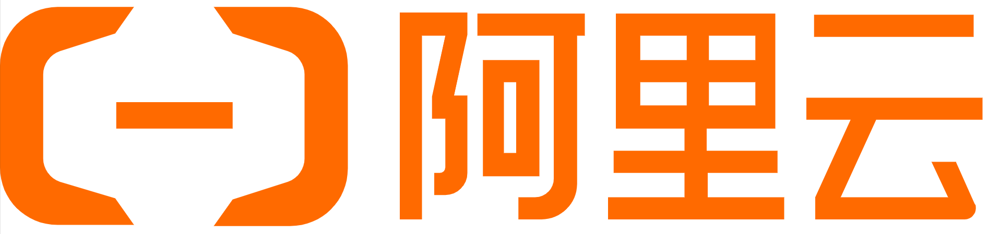

<div align="center">


# New API

**An AI gateway for models, applications, and agents**

<p align="center">
  <a href="./README.zh_CN.md">简体中文</a> |
  <a href="./README.zh_TW.md">繁體中文</a> |
  <strong>English</strong> |
  <a href="./README.fr.md">Français</a> |
  <a href="./README.ja.md">日本語</a>
</p>

<p align="center">
  <a href="https://raw.githubusercontent.com/Calcium-Ion/new-api/main/LICENSE">
    
  </a><!--
  --><a href="https://github.com/Calcium-Ion/new-api/releases/latest">
    
  </a><!--
  --><a href="https://hub.docker.com/r/CalciumIon/new-api">
    
  </a>
  <a href="https://atomgit.com/QuantumNous/new-api" target="_blank">
    
  </a>
</p>

<p align="center">
  <a href="https://trendshift.io/repositories/20180" target="_blank">
    
  </a>
  <br>
  <a href="https://hellogithub.com/repository/QuantumNous/new-api" target="_blank">
    
  </a><!--
  -->
  <a href="https://atomgit.com/QuantumNous/new-api" target="_blank">
    
  </a>
</p>

<p align="center">
  <a href="#capabilities">Capabilities</a> •
  <a href="#quick-start">Quick start</a> •
  <a href="#deployment">Deployment</a> •
  <a href="#development">Development</a> •
  <a href="#documentation">Documentation</a>
</p>

</div>

---

## 📝 Project Description

New API is a self-hosted AI gateway for applications, agents, and teams. Connect upstream model services, expose a consistent API to your clients, and manage routing, access, usage, and costs in one place.

Use it to share authorized model access across a team, switch providers without configuring every client again, or operate a private multi-model service with a web console. Upstreams include OpenAI, Anthropic, Google Gemini, Azure OpenAI, AWS Bedrock, Vertex AI, DeepSeek, Qwen, and other compatible services.

> [!IMPORTANT]
> - This project is intended solely for lawful and authorized AI API gateway, organization-level authentication, multi-model management, usage analytics, cost accounting, and private deployment scenarios.
> - Users must lawfully obtain upstream API keys, accounts, model services, and interface permissions, and must comply with upstream terms of service and applicable laws and regulations.
> - Users should ensure their use complies with upstream terms of service and applicable laws and regulations.
> - When providing generative AI services to the public, users should comply with applicable regulatory requirements and fulfill all filing, licensing, content safety, real-name verification, log retention, tax, and upstream authorization obligations required by their jurisdiction.

<!-- -->

> [!WARNING]
> When operating this project as a public generative AI service or API resale service, users should first complete all required filing, licensing, content safety, real-name verification, log retention, tax, payment, and upstream authorization obligations.

---

## 🤝 Trusted Partners

<p align="center">
  <em>No particular order</em>
</p>

<p align="center">
  <a href="https://www.cherry-ai.com/" target="_blank">
    
  </a><!--
  --><a href="https://github.com/iOfficeAI/AionUi/" target="_blank">
    
  </a><!--
  --><a href="https://bda.pku.edu.cn/" target="_blank">
    
  </a><!--
  --><a href="https://www.compshare.cn/?ytag=GPU_yy_gh_newapi" target="_blank">
    
  </a><!--
  --><a href="https://www.aliyun.com/" target="_blank">
    
  </a><!--
  --><a href="https://io.net/" target="_blank">
    
  </a>
</p>

---

## 🙏 Special Thanks

<p align="center">
  <a href="https://www.jetbrains.com/?from=new-api" target="_blank">
    
  </a>
</p>

<p align="center">
  <strong>Thanks to <a href="https://www.jetbrains.com/?from=new-api">JetBrains</a> for providing free open-source development license for this project</strong>
</p>

---

<a id="capabilities"></a>

## Capabilities

| Area | What you can do |
| --- | --- |
| Model access | Use OpenAI Chat Completions, Responses, Anthropic Messages, and Gemini APIs; stream responses and use tools, reasoning, and multimodal inputs where supported |
| Routing | Configure model mappings, channel priorities and weights, retries, channel affinity, and multiple upstream keys |
| Usage and costs | Manage quotas, subscriptions, usage logs, cache accounting, and expression-based pricing for different usage tiers |
| Access control | Manage users, groups, fine-grained permissions, and API key restrictions; use OAuth/OIDC, passkeys, two-factor authentication, and login session management |
| Asynchronous tasks | Extend image, video, and other task APIs with JavaScript plugins, including task status and output retrieval |
| Web console | Configure channels and models, inspect usage and audit logs, and try models in the playground; available in English, Simplified Chinese, Traditional Chinese, French, Japanese, Russian, and Vietnamese |

### Protocols and endpoints

| Interface | Common endpoints |
| --- | --- |
| OpenAI Chat / Responses | `POST /v1/chat/completions`, `POST /v1/responses` |
| Anthropic Messages | `POST /v1/messages` |
| Gemini | `POST /v1beta/models/{model}:generateContent`, `POST /v1beta/models/{model}:streamGenerateContent` |
| Realtime / Responses WebSocket | `GET /v1/realtime`, `GET /v1/responses` (WebSocket upgrade) |
| Images / audio | `/v1/images/generations`, `/v1/images/edits`, `/v1/audio/speech`, `/v1/audio/transcriptions`, `/v1/audio/translations` |
| Embeddings / rerank | `POST /v1/embeddings`, `POST /v1/rerank` |
| Task plugins | `POST /v1/tasks/{pluginKey}`, `GET /v1/tasks/{taskId}`, plus routes declared by each plugin |

[RelayKit](./relaykit/README.md) provides request, response, and streaming conversion between the four text protocols. Available features depend on the channel, upstream model, and conversion path; protocol-specific tools and fields may not map exactly. WebSocket support also requires a compatible upstream and channel configuration.

This README describes the current source tree. Check the release notes for the version you deploy.

<a id="quick-start"></a>

## Quick start

### Try locally with Docker

This starts a single instance with SQLite and binds it to localhost:

```bash
mkdir -p data
docker run --name new-api -d --restart unless-stopped \
  -p 127.0.0.1:3000:3000 \
  -e TZ=Asia/Shanghai \
  -v "$(pwd)/data:/data" \
  calciumion/new-api:latest
```

Open [http://localhost:3000](http://localhost:3000) and complete the setup wizard to create the administrator account. The `data` directory persists the SQLite database across container replacements.

### Make your first request

1. Add a channel with your upstream API key, available models, and group assignment; run a channel test.
2. Configure model pricing and ensure the user has quota or a valid subscription.
3. Create an API key in the console with access to the same group and models.
4. Set your client's base URL to `http://localhost:3000/v1` for OpenAI-compatible clients and use the **New API-issued key**.

Set `NEW_API_KEY` in your shell to that key. List the models accessible to it:

```bash
curl --fail-with-body http://localhost:3000/v1/models \
  -H "Authorization: Bearer ${NEW_API_KEY}"
```

Then call Responses, replacing `your-enabled-model` with an enabled model that supports this interface:

```bash
curl --fail-with-body http://localhost:3000/v1/responses \
  -H "Authorization: Bearer ${NEW_API_KEY}" \
  -H "Content-Type: application/json" \
  -d '{"model":"your-enabled-model","input":"Hello!"}'
```

<a id="deployment"></a>

## Deployment

### Docker Compose

The repository's [Compose configuration](./docker-compose.yml) starts **New API + PostgreSQL + Redis** by default. It also contains examples for MySQL and a separate ClickHouse log database.

```bash
git clone https://github.com/QuantumNous/new-api.git
cd new-api
```

Before starting, edit `docker-compose.yml`: replace the database and Redis example passwords in both the services and connection strings, and set a persistent random `SESSION_SECRET` (generate one with `openssl rand -hex 32`). For an HTTPS console, configure `SESSION_COOKIE_SECURE=true` and `SESSION_COOKIE_TRUSTED_URL` with its exact public HTTPS origin.

```bash
docker compose up -d
docker compose logs -f new-api
```

### Storage and configuration

| Component | Options |
| --- | --- |
| Main database | SQLite, MySQL ≥ 5.7.8, or PostgreSQL ≥ 9.6 |
| Separate log database | Configure with `LOG_SQL_DSN`; also supports ClickHouse |
| Cache | Optional Redis plus in-memory caching; use shared Redis when application nodes need shared rate limits |
| Container platforms | Linux amd64 / arm64 |

| Variable | Purpose |
| --- | --- |
| `SQL_DSN` | Main database connection; unset uses SQLite |
| `LOG_SQL_DSN` | Optional separate log database connection |
| `REDIS_CONN_STRING` | Redis connection string |
| `SESSION_SECRET` | Persistent authentication secret; all nodes must use the same value |
| `CRYPTO_SECRET` | Defaults to `SESSION_SECRET`; nodes sharing Redis must use the same effective value |
| `SESSION_COOKIE_SECURE` | Set to `true` for an HTTPS console; enables Secure refresh cookies and strict refresh/logout origin checks |
| `SESSION_COOKIE_TRUSTED_URL` | Required in Secure mode: comma-separated exact HTTPS origins, without paths or wildcards; leave unset for local HTTP |
| `TRUSTED_PROXIES` | Trusted reverse-proxy IPs/CIDRs, or `none`; explicitly configure for your network |

See the [environment example](./.env.example), [environment reference](https://docs.newapi.ai/en/docs/installation/config-maintenance/environment-variables), and [authentication and session guide](./docs/authentication.md) for full configuration. Configure container variables in Compose's `environment` or `env_file`; copying `.env.example` alone does not inject variables into the container.

For production, put the console behind HTTPS and configure your reverse proxy for streaming and WebSocket upgrades. Persist and back up the database and mounted data. Multi-node deployments must share the main database and authentication secrets; separate Redis instances or in-memory rate limiters count limits independently per node. The session guide describes propagation behavior for each topology.

Pin an image version from [Releases](https://github.com/QuantumNous/new-api/releases), review its upgrade notes, and back up before upgrading. The `latest` tag follows published builds and can change; migrations and compatibility must be assessed for your existing installation.

<a id="development"></a>

## Development and extensions

The backend uses Go and Gin. The web console uses React 19, TypeScript, Rsbuild, TanStack, and Tailwind CSS 4. Use Bun for frontend dependencies and scripts; see [go.mod](./go.mod) for the Go language baseline and [Dockerfile](./Dockerfile) for the container build toolchain.

Build the frontend before starting the backend, which embeds `web/dist`:

```bash
# Repository root
cd web
bun install --frozen-lockfile
bun run build
cd ..
go run .
```

In a second terminal, start the frontend development server:

```bash
cd web
bun run dev -- --port 5173
```

Open [http://localhost:5173](http://localhost:5173); the development server proxies API requests to the backend on port 3000. For a containerized development backend, see [docker-compose.dev.yml](./docker-compose.dev.yml) and the `make dev` target in [makefile](./makefile).

| Location | Responsibility |
| --- | --- |
| `router/`, `middleware/`, `controller/` | HTTP routes, access checks, and API handlers |
| `relay/` | Upstream adapters and request routing |
| `service/`, `model/` | Business logic and persistence |
| [relaykit/](./relaykit/README.md) | Independently buildable Go module for protocol DTOs and conversions |
| [plugins/tasks/](./plugins/tasks/) | JavaScript task plugins; see [Task Plugin API v1](./docs/plugin-api/v1.md) for authoring and host boundaries |
| `web/` | Web console; see [frontend conventions](./web/AGENTS.md) |
| [electron/](./electron/README.md) | Desktop wrapper and packaging |

Read [AGENTS.md](./AGENTS.md) before contributing. Run checks appropriate to your change, including `make test` for the Go modules and `bun run typecheck`, `bun run lint`, `bun run test`, and `bun run build` in `web/` for frontend changes. Changes to RelayKit must also pass `GOWORK=off go build ./...` from `relaykit/`.

<a id="documentation"></a>

## Documentation and community

| Resource | Link |
| --- | --- |
| Official documentation | [Guides](https://docs.newapi.ai/en/docs) · [Installation](https://docs.newapi.ai/en/docs/installation) · [API reference](https://docs.newapi.ai/en/docs/api) |
| Project exploration | [DeepWiki](https://deepwiki.com/QuantumNous/new-api) |
| Questions and discussion | [FAQ](https://docs.newapi.ai/en/docs/support/faq) · [Community](https://docs.newapi.ai/en/docs/support/community-interaction) |
| Bugs and feature requests | [GitHub Issues](https://github.com/QuantumNous/new-api/issues) |
| Security reports | Follow the [security policy](./.github/SECURITY.md) for private reporting |

For bug reports, include the version, deployment method, reproduction steps, and redacted logs. Documentation, translations, provider integrations, and focused regression tests are all welcome contributions.

---

## 🔗 Related Projects

### Upstream Projects

| Project | Description |
|------|------|
| [One API](https://github.com/songquanpeng/one-api) | Original project base |
| [Midjourney-Proxy](https://github.com/novicezk/midjourney-proxy) | Midjourney interface support |

### Supporting Tools

| Project | Description |
|------|------|
| [new-api-key-tool](https://github.com/Calcium-Ion/new-api-key-tool) | Key quota query tool |
| [new-api-horizon](https://github.com/Calcium-Ion/new-api-horizon) | New API high-performance optimized version |

---

## 📜 License

This project is licensed under the [GNU Affero General Public License v3.0 (AGPLv3)](./LICENSE).

Additional terms under AGPLv3 Section 7 apply. Modified versions must preserve
the author attribution notice `Frontend design and development by New API
contributors.` in the appropriate legal notices and in any prominent about,
legal, footer, or attribution location presented by the user interface.

Modified versions that present a user interface must also preserve a visible
link to the original project: <https://github.com/QuantumNous/new-api>.

This is an open-source project developed based on [One API](https://github.com/songquanpeng/one-api) (MIT License).

If your organization's policies do not permit the use of AGPLv3-licensed software, or if you wish to avoid the open-source obligations of AGPLv3, please contact us at: [support@quantumnous.com](mailto:support@quantumnous.com)

See [NOTICE](./NOTICE) and [third-party licenses](./THIRD-PARTY-LICENSES.md) for attribution and dependency notices.

---

## 🌟 Star History

<div align="center">

[](https://star-history.com/#Calcium-Ion/new-api&Date)

</div>

---

<div align="center">

### 💖 Thank you for using New API

If this project is helpful to you, welcome to give us a ⭐️ Star！

**[Official Documentation](https://docs.newapi.ai/en/docs)** • **[Issue Feedback](https://github.com/Calcium-Ion/new-api/issues)** • **[Latest Release](https://github.com/Calcium-Ion/new-api/releases)**

<sub>Built with ❤️ by QuantumNous</sub>

</div>
